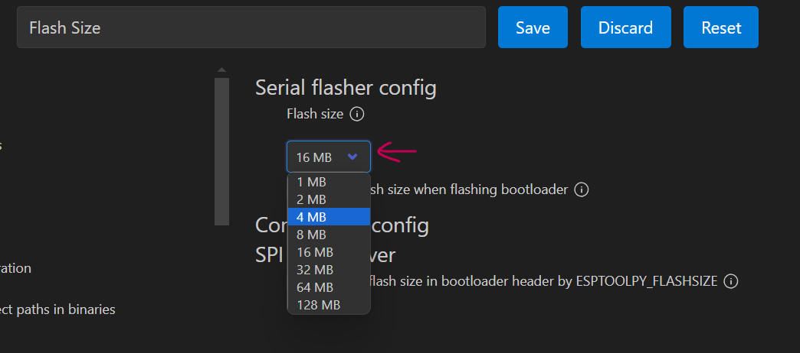
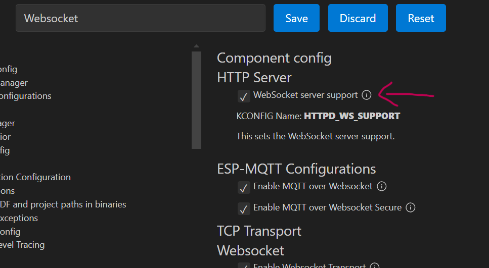

# wifi_driver Library Implementation Steps

### 1. Select Appropriat Target Device (ESP32 Model).

### 2. Now click on Gear Icon for Menu Config

#### A. Select Appropriate Flash Size.

#### B. Enable WebSocket server support.


### 3. Now Save the Config.

### 4. Make `components`  directory and copy paste `wifi_driver` directory inside it.

### 5. Go to `main` directory edit main's cmaklist , add following line to existing content.
Intially 
```
idf_component_register(SRCS "main.c"
                    INCLUDE_DIRS ".")
```
Addition
```
idf_component_register(SRCS "main.c"
                    INCLUDE_DIRS "."
                    REQUIRES wifi_driver)

```
> Note:  
If `REQUIRES` already there then add `wifi_driver` to it.