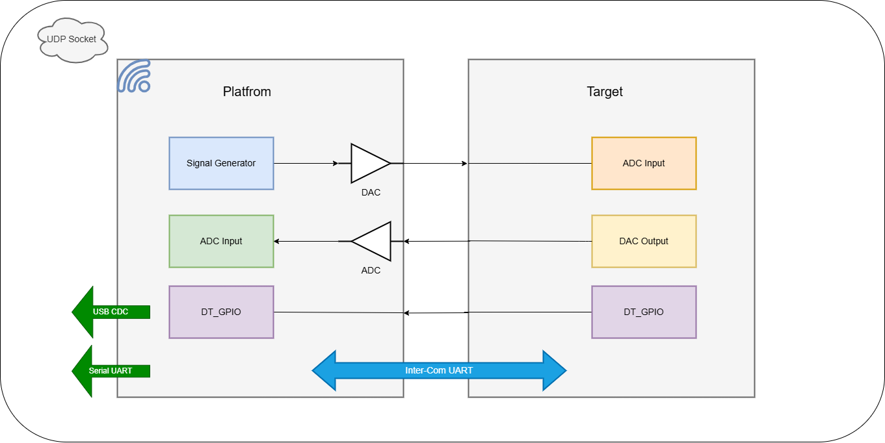

# Real-Time Digital Filter Evaluation Platform

## Description
Platform for designing, testing, and evaluating digital filters on embedded systems in real time.

Platform (ESP32) generates test signal via Signal Generator, outputs through DAC to Target ADC Input. Target executes digital filter, outputs result via DAC Output. Platform samples that output via ADC Input. DT_GPIO line runs bidirectional between Platform and Target for timing/trigger signaling. Inter-Com UART links Platform and Target for control/data exchange.

Platform exposes results externally three ways: UDP Socket (Wi-Fi, streaming to visualizer), USB CDC (bench debug), Serial UART (bench debug).


**Figure:** Block diagram of the System architecture.

---

## Functional Flow

1. ESP32 generates a test signal through its DAC.
2. TARGET MCU samples the signal using its ADC.
3. TARGET MCU processes the signal using the selected digital filter.
4. TARGET MCU outputs the filtered signal through its DAC.
5. ESP32 samples both reference and filtered signals.
6. Packets are assembled into fixed-size batches and streamed over UDP to a host bridge.
7. A Node.js bridge relays UDP batches to browser clients over WebSocket.
8. A Web Worker in the browser parses packets, buffers samples, and applies edge triggering.
9. A canvas-based GUI visualizes filter behavior in near real time.

---

## System Architecture

### Platform (ESP32)

#### Core Modules

- [x] Signal Generator
  - [x] Impulse
  - [ ] Step (deprecated)
  - [x] Sine Wave
- [x] DAC Output (to Target ADC Input)
- [x] ADC Input (from Target DAC Output)
- [x] DT_GPIO (bidirectional, Platform ↔ Target)
- [x] gtimer_handler

#### Communication

- [x] Inter-Com UART (Platform ↔ Target, control/data)
- [x] UART Driver
  - [x] Command Parser
- [x] Wi-Fi Driver (STA mode)
- [x] UDP Socket Handler
  - [x] send data
  - [x] batch framing (`dsm_batch_hdr_t`)
  - [x] compile-time transport switch (USB CDC / UDP)
- [x] USB CDC-ACM Driver (bench / single-packet mode)
- [x] Serial UART output (bench)

### Target MCU

#### Core Modules

- [x] ADC Input (from Platform DAC)
- [x] Digital Filter Lib
- [x] DAC Output (filtered signal, to Platform ADC)
- [x] DT_GPIO (bidirectional, Target ↔ Platform)

#### Communication

- [x] Inter-Com UART (Target ↔ Platform)

---


## Transport Layer

Two transport modes, selected at compile time via `ACTIVE_SEND_MODE` in `dsm_packet.h`:

| Mode | Macro | Packet size | Use case |
|------|-------|--------------|----------|
| USB CDC | `SEND_MODE_USB` | 18 bytes | Bench debug, single packet per send |
| UDP | `SEND_MODE_UDP` | 20 bytes | Wireless streaming, batched packets |

UDP mode adds a `seq` field (16-bit, per-packet) to `dsm_packet_t` for loss detection at the sample level, on top of batch-level loss detection.

### Batch framing (UDP mode only)

```c
typedef struct {
    uint32_t batch_id;
    uint16_t count;
} dsm_batch_hdr_t;   // packed to 6 bytes
```

`UDP_BATCH_SIZE` (default 20) packets are accumulated on-device, then sent as one `sendto()` call:

```
[ dsm_batch_hdr_t | packet_0 | packet_1 | ... | packet_N-1 ]
```

One datagram at default settings: 6 + 20×20 = 406 bytes — under MTU, no IP fragmentation.

`batch_id` increments per datagram. Host-side detects gaps to flag dropped batches.

---

## Current Implementation Deliverables

- [x] Configurable Sampling Frequency (Self)
- [x] Filter Mode Selection
- [x] Runtime Coefficient Update
- [x] Internal Filter Simulation on ESP32
- [x] UART-Based Configuration Interface
- [x] Filter Evaluation
- [x] Real-Time Data Streaming via UDP
- [x] Web-Based Visualization Dashboard
- [x] Runtime Filter Configuration (Target)
- [x] Runtime-Adjustable Sample Window (Visualizer)
- [x] Edge-Triggered Stable Display (Visualizer)

---

## UART Commands

| Command            | Description |
|-------------------|-------------|
| `reset`           | Resets the filter processing system to its default configuration. Aborts any ongoing coefficient upload, restores default coefficients, and reinitializes the filter state. |
| `ar`              | Performs a software restart of the ESP32 (`esp_restart()`). |
| `start`           | Starts the GPTimer and resumes real-time signal processing. |
| `stop`            | Stops the GPTimer and pauses real-time signal processing. |
| `imode:<mode>`    | Sets the input signal source. The `<mode>` string is converted using `str_to_imode()`. |
| `freq:<value>`    | Sets the generated input signal frequency (Hz). Example: `freq:1000`. |
| `amp:<value>`     | Sets the generated input signal amplitude. Example: `amp:1000`. |
| `fmode:<filter>`  | Selects the active filter type. Example: `fmode:iirf`, `fmode:firf`, `fmode:sosf`, etc. |
| `gcoeff`          | Prints the currently active filter coefficients to the UART terminal. |
| `scoeff:<filter>` | Begins coefficient upload mode for the specified filter type. Stops the timer and waits for a `.utx` coefficient file to be transmitted line-by-line. |
| `wave:sin`        | Selects a sinusoidal waveform as the signal generator input. |
| `wave:imp`        | Selects an impulse waveform as the signal generator input. |

### Coefficient Upload Sequence

The filter coefficient update is performed using the following command sequence:

| Step | UART Command | Description |
|------|--------------|-------------|
| 1 | `scoeff:<filter>` | Puts the firmware into coefficient loading mode for the selected filter type. |
| 2 | `.utx` file contents | The host transmits the generated coefficient file line-by-line over UART. |
| 3 | Automatic validation | The firmware validates the received coefficients. |
| 4 | Automatic activation | If validation succeeds, the uploaded coefficients become the active filter and the timer is restarted automatically. |
| 5 | Error handling | If validation fails, the firmware restores the default coefficients and exits coefficient loading mode. |

### Example Commands

```text
start
stop
reset
ar

imode:sim
freq:500
amp:1000

fmode:iirf
gcoeff

scoeff:firf
<send generated .utx file>

wave:sin
wave:imp
```

# Current Implementation Notes

Snapshot of what's actually built, as of this UDP/visualizer integration pass.

---

## 1. Firmware — Packet Format

`dsm_packet.h` defines transport mode at compile time:

```c
#define ACTIVE_SEND_MODE SEND_MODE_UDP   // or SEND_MODE_USB
#define UDP_BATCH_SIZE 20
```

`dsm_packet_t` (packed, 2-byte alignment):

| Field | Type | Bytes | UDP only |
|-------|------|-------|----------|
| sig | uint8_t | 1 | |
| n | uint8_t | 1 | |
| seq | uint16_t | 2 | yes |
| adc_in | int16_t | 2 | |
| fgen_out | int16_t | 2 | |
| filt_x | int16_t | 2 | |
| filt_y | int16_t | 2 | |
| dac0 | int16_t | 2 | |
| dac1 | int16_t | 2 | |
| dt | int16_t | 2 | |
| crc16 | uint16_t | 2 | |

Total: 18 bytes (USB) / 20 bytes (UDP). Verified with `_Static_assert`.

`dsm_batch_hdr_t` (packed to 1-byte alignment — required, default alignment would pad to 8 bytes and break parsing):

```c
#pragma pack(push, 1)
typedef struct {
    uint32_t batch_id;
    uint16_t count;
} dsm_batch_hdr_t;
#pragma pack(pop)
```

6 bytes fixed.

---

## 2. Firmware — Send Path (`main.c`)

Per sampling tick (5 kHz):

- Build `s_dsm_pkt`, compute XOR16 CRC.
- **USB mode**: `usb_cdc_write()` — one packet per call, unchanged from original.
- **UDP mode**:
  - Copy packet into `s_batch_buf` at `sizeof(hdr) + idx * sizeof(dsm_packet_t)`.
  - Increment `s_batch_idx`.
  - On reaching `UDP_BATCH_SIZE`: fill header (`batch_id++`, `count`), memcpy header to buffer front, `wifi_udp_handler_send()`, reset index.

`s_dsm_pkt.seq` increments per packet (16-bit, wraps ~65k). Independent of the existing 2-bit sequence packed into `.n`, which stays for USB-mode compatibility.

`wifi_udp_handler_init()` called once in `app_main()`, before the sampling loop, UDP mode only.

---

## 3. Firmware — Known Issue Fixed

**Symptom**: visualizer showed triangle-wave noise instead of real signal shapes.

**Cause**: `dsm_batch_hdr_t` without explicit packing — natural alignment padded it to 8 bytes on-device. Host-side parser assumed 6 bytes. Every packet after the first in a batch was read from the wrong offset.

**Fix**: `#pragma pack(push, 1)` on the header struct. No host-side change needed — worker.js already assumed 6 bytes.

**Also hit**: `sendto()` failing with `errno=12` (ENOMEM) at boot. Traced to lwIP pbuf pool exhaustion under 5 kHz batched-send load — not an IP/network config issue. Confirmed by testing a single small `sendto()` call in isolation before enabling batch mode.

---

## 4. Host — UDP-to-WebSocket Bridge

`server/udp-ws-bridge.js` (Node.js, `ws` package):

- `dgram` socket, binds UDP port 2812 (must match `wifi_udp_handler_config.target_port` on ESP32).
- `WebSocketServer` on port 8080.
- Relays every incoming UDP datagram verbatim (binary) to all connected WebSocket clients. No parsing on the bridge — parsing happens in the browser.

Run: `npm install && node udp-ws-bridge.js`.

---

## 5. Browser — Web Worker (`public/worker.js`)

Owns the WebSocket connection and all binary parsing, off the main thread.

- Parses batch header (6 bytes) then N × 20-byte packets per incoming binary WS message.
- Maintains a circular buffer per channel, sized `2 × sampleCount` (headroom for trigger search).
- **Loss detection**: tracks `batch_id` gaps → `droppedBatches` counter, sent to UI.
- **Edge trigger**: before emitting a display frame, searches the unwrapped buffer for a rising-edge crossing of the midpoint level on `filt_x`. Slices `sampleCount` samples starting at that crossing. This is what makes the display static for a periodic signal — without it, the window free-runs and the waveform visibly scrolls/drifts, since sample_count and signal period rarely divide evenly against the batch cadence.
- `sampleCount` is runtime-adjustable — main thread posts `setSampleCount`, worker reallocates buffers and resets.

---

## 6. Browser — UI (`public/index.html`)

- Fixed-size canvas (1100×480), all 6 channels drawn per frame, auto-scaled Y axis per frame based on currently-enabled channels.
- Sample count field: live-editable, 20–5000, applies immediately.
- Legend: click a channel to toggle visibility.
- Stats bar: total packets received, dropped batches, live packet rate (2 s rolling window).
- WS URL field defaults to `ws://localhost:8080`, editable for remote bridge.

---

## 7. Open Items / Not Yet Done

- Trigger channel (`filt_x`) and trigger level are hardcoded in `worker.js`. No UI control yet.
- No CRC verification on host side — CRC16 is computed on-device but not checked in the bridge or worker.
- No timestamp field in batch header (removed by design — fixed sample count per canvas draw was judged sufficient for now).
- lwIP pbuf pool sizing fix (menuconfig) — pending confirmation this fully resolves ENOMEM under sustained load, not just at boot.